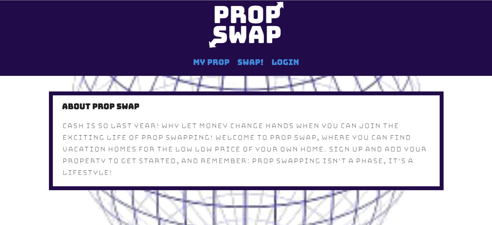

# Prop Swap

-[Description](#description) -[Purpose](#purpose) -[Usage](#usage) -[Mock-up](#) -[Credits](#credits) -[License](#license)

## Description

Prop Swap was created to offer users an app to swap properties for a set period of time cash free. Prop Swap is a full stack MERN application.

## Purpose

The purpose of this application is to offer users a place to swap their properties for vacationing, business travel, etc..

## Usage

1. Prop Swap is availible at https://prop-swapper.herokuapp.com/
2. Visit our login or signup page
3. Begin Swapping!

## Mock-Up

## Credits

Teddy Sahr, David Silveira, Mordechai Gerstley, and Will Haberer. Github repository: https://github.com/daviewave/Prop-Swapper

## License

MIT License

Copyright (c) [2022]
